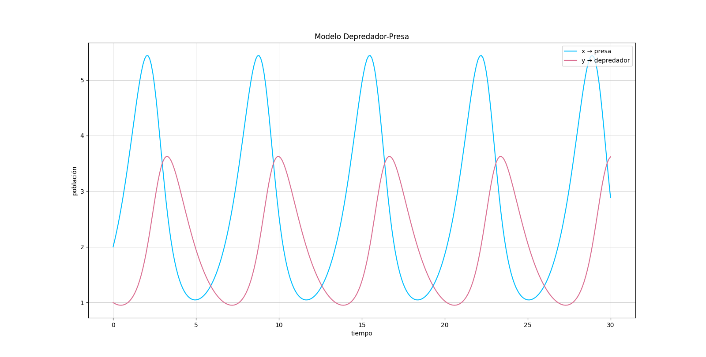

# Trabajo Práctico N° 2 - Ecuaciones Diferenciales Ordinarias

| Nombre alumno             | Padron | Mail                      |
|---------------------------|--------|---------------------------|
| Francisco Orquera Lorda   | 105554 | forqueral@fi.uba.ar       |
| Carolina Di Matteo        | 103963 | cdimatteo@fi.uba.ar       |
| Anita Vernieri            | 104734 | avernieri@gmail.com       |
| María Zanatta             | 108148 | mzanatta@fi.uba.ar        |

### Introducción
La presente entrega contiene las funcionalidades pedidas para el Trabajo Práctico N°2 de la materia Análisis Numérico I (75.12) - Curso Sassano.

### Ejecución
Para la ejecución del ejercicio n°1 de Resolución de EDOs:
> $ python3 Runge-Kutta_Orden4.py

### Visualización de Gráficos Obtenidos

### Informe de Análisis

[Link al Informe de Análisis](./TP2%20-%20Ecuaciones%20Diferenciales%20Ordinarias.pdf)
