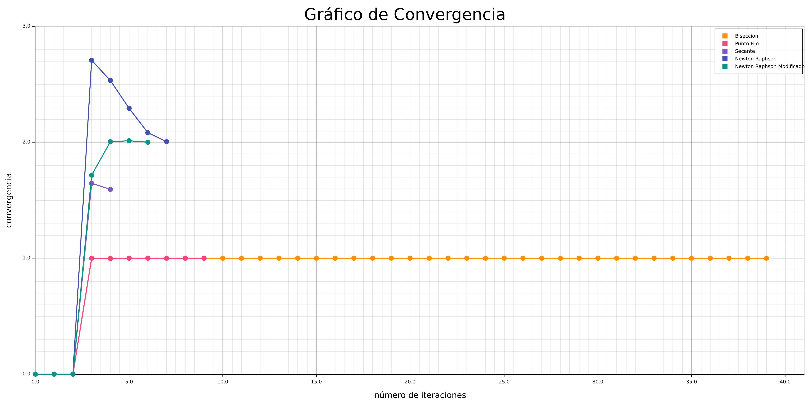
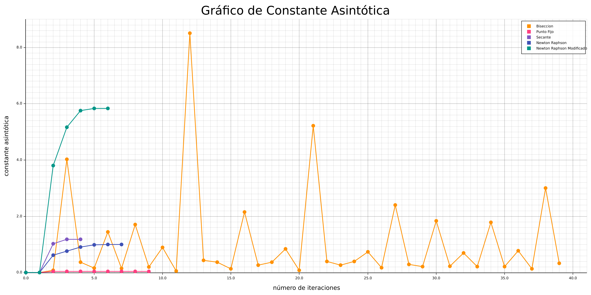
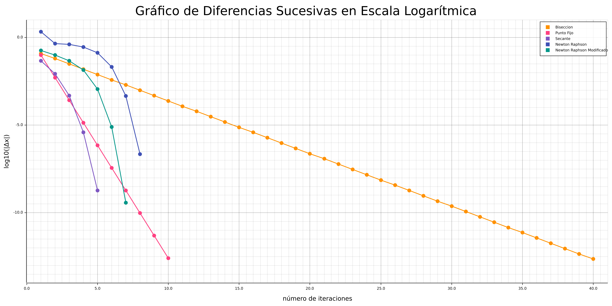
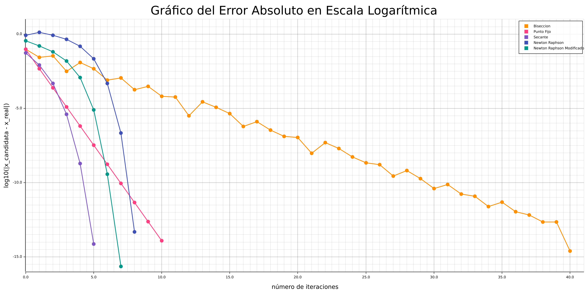

# Trabajo Práctico N° 1 - Búsqueda de Raíces

| Nombre alumno             | Padron | Mail                      |
|---------------------------|--------|---------------------------|
| Francisco Orquera Lorda   | 105554 | forqueral@fi.uba.ar       |
| Carolina Di Matteo        | 103963 | cdimatteo@fi.uba.ar       |
| Anita Vernieri            | 104734 | avernieri@gmail.com       |
| María Zanatta             | 108148 | mzanatta@fi.uba.ar        |

### Introducción
La presente entrega contiene las funcionalidades pedidas para el trabajo practico N°1 de la materia Análisis Numérico I (75.12) - Curso Sassano.

### Ejecución
Para la ejecución del ejercicio n°2 de Búsqueda de Raíces:
> $ cargo run

Para la ejecución del ejercicio n°3 de Polinomio Interpolante:
> $ python3 polinomio_de_newton.py

### Visualización de Gráficos Obtenidos

### Informe de Análisis

[Link al informe de Análisis](./TP1%20-%20Búsqueda%20de%20Raíces.pdf)
